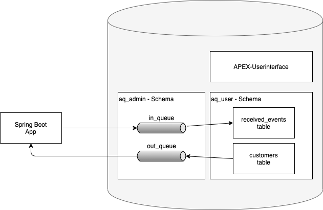

# db-external-integration-using-advanced-queuing

This examples shows how to integrate Oracle database with the outside world using Advanced Queueing.



When data was manipulated (insert, update, delete) in the customer table a trigger creates an event and puts this event into an advanced queue (out_queue). The event data is provided as JSON object and follows the structure defined by [cloudevents.io](https://cloudevents.io/). A Spring application consumes events from the out_queue and provides a confirmation event back to the in_queue. Internally within the database when the event is consumed from the in_queue the data will be written to the database table "received_events."

With this approach outside functionality in any programming language can be integrated with database functionality.

## Project Structure

```
+-- doc = files for documentatio purposes
+-- oracle-aq-event-processor = Spring application
+-- oracle-database
|   +-- sql = SQL scripts to create all needed database objects
|   +-- apex = Contains the exported APEX application
```

## Installation

### Pre-Requisites

- You need an Oracle Database 12c or above.
- Optional: Apex 19c must be installed when the application should be used.

**Recommendation**: Use the Vagrant image with Oracle XE and Apex installed ([github](https://github.com/oracle/vagrant-boxes/tree/master/OracleAPEX))

### Steps

1. Create database users with script ./oracle-database/sql/create_users.sql

2. Connect as user aq_admin to the database and create necessary database objects:

    a. ./oracle-database/sql/create_aqs.sql

3. Connect as user aq_user to the database and create necessary database objects:

    a. ./oracle-database/sql/create_tables.sql

    b. ./oracle-database/sql/receive_event_notification_proc.sql

    c. ./oracle-database/sql/send_event_notification_proc.sql

4. Optional import the Apex application from ./oracle-database/apex/Queuing-Example-Apex-Export.sql

5. Navigate to ./oracle-aq-event-processor and execute the following command:

      mvn spring-boot:run
